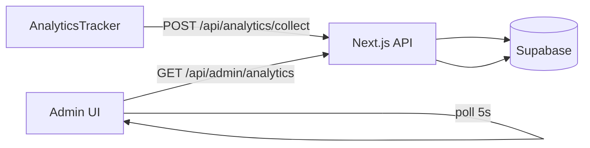

# Admin Analytics, email đơn hàng, login admin, animation Motto, quên MK

Tài liệu gom các thay đổi từ **phân trang bảng Admin → Analytics** trở về trước (không gồm StusportLogo).

---

## Mục lục

1. [Admin → Analytics — phân trang bảng](#1-admin--analytics--phân-trang-bảng)
2. [Admin → Analytics — hệ thống tracking](#2-admin--analytics--hệ-thống-tracking)
3. [Email xác nhận đơn hàng sau PayOS](#3-email-xác-nhận-đơn-hàng-sau-payos)
4. [Giao diện đăng nhập Admin](#4-giao-diện-đăng-nhập-admin)
5. [Animation vào trang Motto (homepage)](#5-animation-vào-trang-motto-homepage)
6. [Quên mật khẩu (khách + admin)](#6-quên-mật-khẩu-khách--admin)
7. [Checklist triển khai](#7-checklist-triển-khai)

---

## 1. Admin → Analytics — phân trang bảng

### Vấn đề

Dashboard analytics có nhiều bảng/danh sách realtime (khách đang online, tương tác, top sản phẩm, top trang, click nút). Trên mobile, cuộn dài khó dùng.

### Giải pháp

Hook client **`useTablePagination`** + UI **`AnalyticsTablePagination`** (nút Trước/Sau, hiển thị `from–to / total`).

| Thành phần | File | `pageSize` |
|------------|------|------------|
| Khách đang online (bảng chi tiết) | `components/admin/analytics/LiveVisitorsDetail.tsx` | **5** |
| Hoạt động gần đây (realtime) | `components/admin/analytics/RecentInteractionsTable.tsx` | **6** |
| Lượt xem & click theo sản phẩm | `components/admin/analytics/TopProductsTable.tsx` | **5** |
| Trang truy cập nhiều nhất | `components/admin/analytics/TopPagesTable.tsx` | **5** |
| Tổng hợp click nút | `components/admin/analytics/ButtonClicksList.tsx` | **6** |

**Hook:** `components/admin/analytics/useTablePagination.ts`

- Tự chỉnh `page` khi `totalPages` giảm (dữ liệu poll mới).
- `showPagination` = `total > pageSize` — ẩn pager khi không cần.

**UI pager:** `components/admin/analytics/AnalyticsTablePagination.tsx`

### Cách chỉnh page size

Sửa hằng `PAGE_SIZE` / `VISITOR_PAGE_SIZE` ở đầu từng component bảng (không cần đổi hook).

---

## 2. Admin → Analytics — hệ thống tracking

### Luồng dữ liệu



### Thu thập (client)

- **`components/store/AnalyticsTracker.tsx`** — mount trong `app/layout.tsx`.
- Session ID: `localStorage` key `stusport_analytics_sid`.
- Heartbeat mỗi **20s** (`presence`).
- Sự kiện: `pageview`, `click` (qua `data-track="…"`), `product_view` (path `/san-pham/…`).

**API collect:** `app/api/analytics/collect/route.ts`

- Ghi `analytics_presence`, `analytics_page_views`, `analytics_events`.
- **Thiết bị:** parse `User-Agent` + `deviceHint` (mobile/tablet/desktop).
- **Quốc gia:** header `x-vercel-ip-country` (chỉ có khi deploy Vercel).

### Admin đọc dữ liệu

- **`lib/admin/analytics/data.ts`** — aggregate dashboard.
- **`app/api/admin/analytics/route.ts`** — chỉ admin (session + `is_admin`).
- **`lib/admin/analytics/useAdminAnalytics.ts`** — poll **`/api/admin/analytics`** mỗi **5s**.
- **UI:** `components/admin/analytics/AnalyticsOverviewClient.tsx` (+ các card/bảng con).

**Presence “live”:** coi online nếu `last_seen_at` trong **2 phút** (`PRESENCE_WINDOW_MS`).

### SQL Supabase (bắt buộc)

Chạy **theo thứ tự** trong SQL Editor:

1. **`supabase/analytics.sql`** — bảng `analytics_presence`, `analytics_page_views`, `analytics_events` + index + RLS.
2. **`supabase/analytics-v2.sql`** — cột `device_type`, `country_code`, `product_id` + index bổ sung.

Client **không** ghi trực tiếp Supabase; mọi ghi đọc qua API Next (service role).

### Vercel Analytics (tùy chọn)

Card trong dashboard link tới Vercel nếu có `VERCEL_PROJECT_ID` / `VERCEL_URL`. Tracking riêng của Vercel — **không thay** analytics tự host.

### Gắn track click sản phẩm

Trên nút/card sản phẩm, thêm attribute ví dụ:

```html
data-track="Mua ngay"
```

Tracker lắng `click` và gửi `event_name: "click"` kèm `label`.

---

## 3. Email xác nhận đơn hàng sau PayOS

### Vấn đề

Email chỉ gửi từ webhook PayOS; luồng **success page → confirm-payment** cập nhật đơn nhưng **không** gửi mail.

### Giải pháp

**`lib/orders/send-order-confirmation-email.js`**

- Hàm **`maybeSendOrderConfirmationEmail(orderId)`** — idempotent.
- Chỉ gửi khi `status` ∈ `deposit_paid` | `payment_verified`.
- Bỏ qua nếu đã có **`confirmation_email_sent_at`**.

**Gọi từ hai nơi:**

- `app/api/webhook/payos/route.js`
- `app/api/orders/[id]/confirm-payment/route.js`

**SQL:** `supabase/orders-confirmation-email.sql` — thêm cột `orders.confirmation_email_sent_at`.

**Template:** `emails/OrderConfirmationEmail` (React Email + nodemailer Gmail).

### Biến môi trường

| Biến | Mục đích |
|------|----------|
| `GMAIL_USER` | Tài khoản Gmail gửi |
| `GMAIL_APP_PASSWORD` | App password |
| `NEXT_PUBLIC_SUPABASE_URL` | Supabase |
| `SUPABASE_SERVICE_ROLE_KEY` | Đọc order + user |

Chi tiết PayOS: [PAYOS-SETUP.md](../../PAYOS-SETUP.md).

---

## 4. Giao diện đăng nhập Admin

### Mục tiêu

Trang `/login`, quên MK, đặt lại MK admin dùng **dark + cam Stusport** (`#f24e35`), không slate/emerald mặc định Tailwind.

### File chính

| File | Vai trò |
|------|---------|
| `styles/pages/admin-login.css` | Token màu, card, input, nút primary |
| `components/admin/AdminAuthShell.tsx` | Layout bọc form |
| `components/admin/LoginForm.tsx` | Đăng nhập + link quên MK |
| `components/auth/ForgotPasswordForm.tsx` | Quên MK (prop `audience="admin"`) |
| `components/auth/ResetPasswordForm.tsx` | Đặt lại MK admin |

Import CSS admin auth trong layout/page login tương ứng (xem `app/login/`).

---

## 5. Animation vào trang Motto (homepage)

### Vấn đề

Loader/hero đôi khi **không hiện trên desktop** (paint nhanh, GSAP chưa kịp; hero `.intro`/`.cta` `opacity: 0`); mobile ổn hơn. Quay lại tab (**bfcache**) có thể kẹt loader.

### Giải pháp

**Loader — `components/motto/MottoLoader.tsx`**

- `useLayoutEffect` thay vì chỉ `useEffect`.
- **`MIN_VISIBLE_MS = 1900`** — loader luôn hiện đủ lâu trên desktop.
- `prefers-reduced-motion`: rút ngắn (~550ms).

**Trang — `components/motto/MottoHomePage.tsx`**

- **`INTRO_FAILSAFE_MS = 4000`** — ép `entered = true` nếu loader không callback.
- Listener **`pageshow`** + `event.persisted` (bfcache) → bỏ loader.

**Hero — `components/motto/MottoHero.tsx` + `MottoHero.module.css`**

- GSAP timeline khi `ready === true`; **`REVEAL_FAILSAFE_MS = 2800`**.
- CSS fallback: `[data-ready="true"]` / class `.heroAppear` → hiện `.media`, `.intro`, `.cta` dù GSAP lỗi.

---

## 6. Quên mật khẩu (khách + admin)

### Trang

| Đối tượng | Quên MK | Đặt lại MK | Đăng nhập |
|-----------|---------|------------|-----------|
| Khách | `/quen-mat-khau` | `/dat-lai-mat-khau` | `/dang-nhap` |
| Admin | `/login/quen-mat-khau` | `/login/dat-lai-mat-khau` | `/login` |

Callback: **`/auth/callback?next=…`**

### Code

- **`lib/auth/password-reset.ts`** — path, `buildPasswordResetRedirectTo`, map lỗi Supabase.
- **`components/auth/ForgotPasswordForm.tsx`**, **`ResetPasswordForm.tsx`** — prop `audience: "customer" | "admin"`.
- **`app/auth/callback/route.ts`** — đổi session recovery → redirect `next`.

**Cấu hình Supabase + env:** xem [AUTH-PASSWORD-RESET.md](../../AUTH-PASSWORD-RESET.md).

---

## 7. Checklist triển khai

### Supabase SQL

- [ ] `supabase/analytics.sql`
- [ ] `supabase/analytics-v2.sql`
- [ ] `supabase/orders-confirmation-email.sql`

### Vercel / `.env`

- [ ] `NEXT_PUBLIC_SITE_URL` — link reset password, email
- [ ] `GMAIL_USER`, `GMAIL_APP_PASSWORD` — email đơn hàng
- [ ] `SUPABASE_SERVICE_ROLE_KEY` — API analytics + email
- [ ] (Tùy chọn) Deploy Vercel để có `x-vercel-ip-country` cho analytics quốc gia

### Supabase Auth

- [ ] Redirect URLs cho `/auth/callback`, `/dat-lai-mat-khau`, `/login/dat-lai-mat-khau`
- [ ] Email auth bật (SMTP hoặc Supabase default)

### Kiểm tra nhanh

1. **Analytics:** mở site → Admin → Analytics — số live visitor tăng; bảng có phân trang khi > 5–6 dòng.
2. **Email:** thanh toán PayOS → nhận mail (chỉ một lần / đơn).
3. **Login admin:** `/login` — nền tối, nút cam.
4. **Motto:** refresh `/` — loader ~2s rồi hero fade in.
5. **Quên MK:** `/quen-mat-khau` → email → `/dat-lai-mat-khau`.

---

## File tham chiếu nhanh

```
app/api/analytics/collect/route.ts
app/api/admin/analytics/route.ts
app/api/orders/[id]/confirm-payment/route.js
app/api/webhook/payos/route.js
components/admin/analytics/
components/motto/MottoLoader.tsx
components/motto/MottoHomePage.tsx
components/motto/MottoHero.tsx
components/store/AnalyticsTracker.tsx
lib/admin/analytics/
lib/auth/password-reset.ts
lib/orders/send-order-confirmation-email.js
styles/pages/admin-login.css
supabase/analytics.sql
supabase/analytics-v2.sql
supabase/orders-confirmation-email.sql
```
